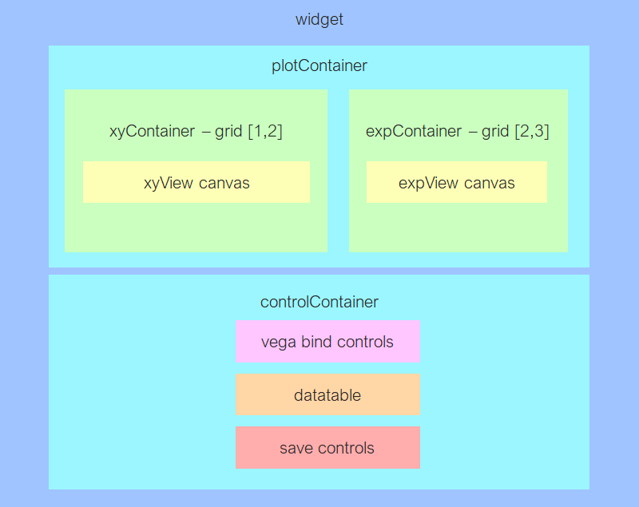
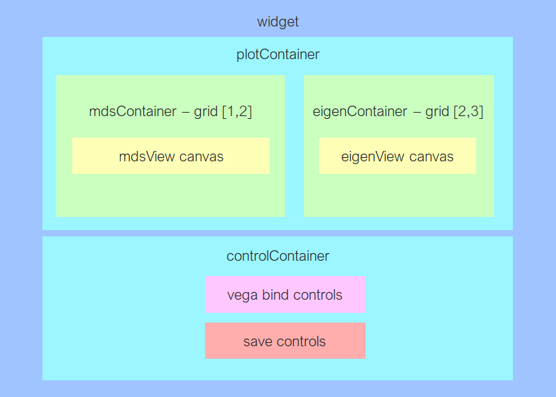
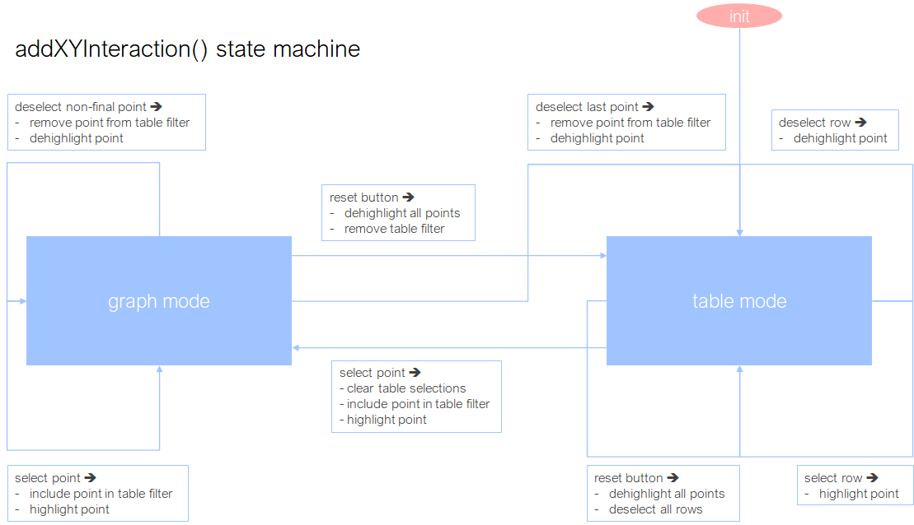

# GlimmaV2 Spec
## Code Structure
```             
├── DESCRIPTION
├── GlimmaV2.Rproj
├── inst
│   └── htmlwidgets
│       ├── glimmaMDS.js--------------------------> frontend interface for glimmaMDS()
│       ├── glimmaMDS.yaml------------------------> project dependencies for glimmaMDS()
│       ├── glimmaXY.js---------------------------> frontend interface for glimmaMA/XY/Volcano
│       ├── glimmaXY.yaml-------------------------> project dependencies for glimmaMA/XY/Volcano
│       └── lib
│           ├── FileSaver
│           │   └── FileSaver.js-------------------> API used to save CSV files
│           ├── GlimmaV2
│           │   ├── expressionSpec.js--------------> houses createExpressionSpec()
│           │   ├── makeTooltip.js-----------------> houses makeVegaTooltip()
│           │   ├── MDSSpecs.js--------------------> houses createMDSSpec(), createEigenSpec()
│           │   ├── saveTools.js-------------------> houses addSavePlotButton(), saveTableClickListener(),
|           |   |                                       saveJSONArrayToCSV(), JSONArrayToCSV()
│           │   └── XYSpecs.js---------------------> houses createXYSpec()
│           ├── vega
│           │   ├── vega.js------------------------> main vega library
│           │   ├── vega.min.js
│           │   └── vega_plots.css-----------------> main GlimmaV2 stylesheet; consider changing for clarity
│           └── vega-tooltip-----------------------> tooltip library
│               ├── vega-tooltip.css
│               └── vega-tooltip.js
├── NAMESPACE
├── R
│   ├── glimmaMA.R---------------------------------> houses glimmaMA()
│   ├── glimmaMDS.R--------------------------------> houses glimmaMDS()
│   ├── glimmaVolcano.R----------------------------> houses glimmaVolcano()
│   ├── glimmaXY.R---------------------------------> houses glimmaXY(), buildXYData(), glimmaXYWidget()
│   └── helperFunctions.R--------------------------> houses documentation descriptions and extractGroups()
└── README.md
```
## HTML Layout
GlimmaV2 is rendered within a parent widget HTML element in which it spawns the two different hierarchies given below, depending on which plot is being displayed. Both the XY-style plot and the MDS plot share a general structure to improve modularity: a plotContainer encapsulates the rendered Vega plots, and a controlContainer contains interactive components such as dropdowns, tables and save buttons which apply changes to the plot. The main difference in structure between the MDS and XY layout is that the MDS plot lacks the datatable.

### XY/MA/Volcano Plot

- the controlContainer is dominated by the datatable
- the datatable div contains the selected gene display, buttons for saving and clearing table data as well as a search input form
- the vega-bindings div within the expressionContainer contains the max_y_axis input form, as well as an alert box to warn the user if the value is not greater than the maximum
- CSS grid will be used to render xyView and expView plots on the same line to avoid another dependency on bootstrap
### MDS Plot

- an empty block element (not shown) is used to structure the vega binds in controlContainer into separate lines
- simpler and much more lightweight than the XY plot without the datatable

## XY Plot Interaction

